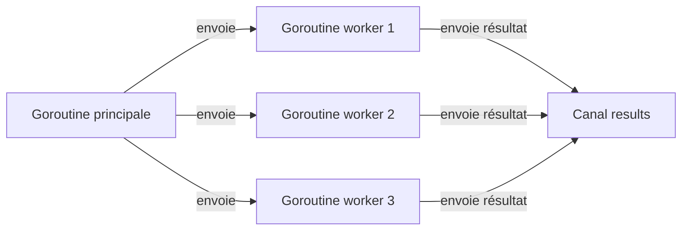

# Article 1-1-1 : Google, Rob Pike, Ken Thompson – pourquoi Go en 2009

## 1-1-Contexte de création de Go

En 2007, trois ingénieurs de Google, Robert Griesemer, Rob Pike et Ken Thompson, ont amorcé la création d'un nouveau langage de programmation, Go (souvent appelé Golang). La naissance de Go répondait à un besoin précis au sein de Google : améliorer la productivité des développeurs en proposant un langage à la fois simple, efficace et capable de gérer la complexité croissante des systèmes modernes.

## Pourquoi Go en 2009 ?

Google disposait déjà d'un grand nombre de systèmes internes écrits en C++, Java ou Python, mais ces langages présentaient des inconvénients majeurs :
- **Temps de compilation long** qui ralentissait le cycle de développement.
- **Gestion parfois complexe de la mémoire** et des concurrents dans C/C++.
- **Concurrence difficile à exprimer et à maintenir** dans ces langages.
- Des **outils incomplets ou trop lourds** pour le développement à grande échelle.

Go a donc été imaginé pour répondre à ces enjeux avec ces objectifs principaux :
- **Compilé et rapide :** Go compile rapidement, même des projets de grande taille.
- **Syntaxe simple et lisible :** Inspiré de C, mais sans complexités inutiles.
- **Gestion native de la concurrence** grâce au modèle CSP (Communicating Sequential Processes).
- **Garbage collection :** Pour faciliter la gestion mémoire tout en gardant des performances élevées.
- **Un écosystème intégré :** Un outil standard complet regroupant compilateur, formatteur, gestionnaire de paquets.

Le choix d'un langage inventé « maison » pour Google était stratégique : il fallait un langage flexible, performant et adapté aux besoins de développement à grande échelle qui ne pouvait être atteint facilement avec des langages existants.

## Les créateurs et leurs inspirations

- **Ken Thompson**, co-créateur de Unix et du langage C, a apporté son expertise sur la simplicité et la puissance d'expression.
- **Rob Pike**, connu pour ses travaux sur les interfaces graphiques et sur les systèmes d'exploitation Plan 9 et Inferno, a fortement influencé la dimension concurrente et les paradigmes modernes.
- **Robert Griesemer** a contribué à la conception du compilateur et des structures internes.

Go s'inspire de concepts avancés comme le CSP pour la gestion de la concurrence, un modèle établi en 1978, qui permet d'écrire des programmes composés de processus simples communiquant via des canaux, plutôt que des verrous ou des sections critiques complexes.

### Exemple simple de concurrence en Go utilisant les goroutines et les canaux :

```go
package main

import (
    "fmt"
    "time"
)

func worker(tasks <-chan int, results chan<- int) {
    for task := range tasks {
        fmt.Println("Traitement de la tâche", task)
        time.Sleep(time.Second) // Simule un travail
        results <- task * 2
    }
}

func main() {
    tasks := make(chan int, 5)
    results := make(chan int, 5)

    // Lancer 3 travailleurs concurrents
    for i := 0; i < 3; i++ {
        go worker(tasks, results)
    }

    // Envoyer des tâches
    for i := 1; i <= 5; i++ {
        tasks <- i
    }
    close(tasks)

    // Collecter les résultats
    for i := 0; i < 5; i++ {
        fmt.Println("Résultat", <-results)
    }
}
```

Ce petit programme montre comment Go gère facilement des tâches simultanées via les **goroutines** (fonctions qui s'exécutent en parallèle) et les **canaux** qui permettent une communication sécurisée entre elles.

### Diagramme Mermaid illustrant le modèle concurrent de Go



## Conclusion

La création de Go en 2009 répondait à un besoin spécifique de Google : disposer d’un langage moderne, performant, simple et adapté à la construction de systèmes à grande échelle et concurrentiels. La combinaison d’idées provenant de C, CSP, et la volonté d'optimiser la productivité des développeurs a fait de Go un langage aujourd’hui incontournable pour les systèmes distribués, les infrastructures cloud et les microservices.

## Sources

- [Wikipedia - Go (programming language)](https://en.wikipedia.org/wiki/Go_(programming_language))
- [EBSCO Research - Go programming language](https://www.ebsco.com/research-starters/language-and-linguistics/go-programming-language)
- [Communicating Sequential Processes (CSP) concept](https://en.wikipedia.org/wiki/Communicating_sequential_processes)
- [QArea: Golang History: Evolution or Revolution?](https://qarea.com/blog/the-evolution-of-go-a-history-of-success)
- [The Go Programming Language and Environment - ACM](https://cacm.acm.org/research/the-go-programming-language-and-environment)