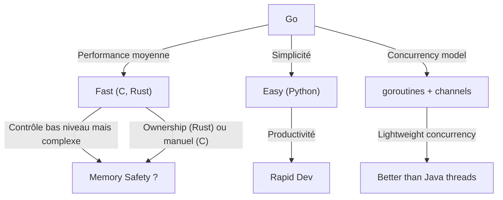

# Article 1-2-1 : Compromis entre performance et simplicité, avantages et limites — Positionnement de Go par rapport à C, Java, Python et Rust

## 1-2-Positionnement par rapport à C, Java, Python, Rust

Go est un langage qui occupe une place spécifique dans l’écosystème des langages de programmation modernes. Son design correspond à un compromis entre plusieurs objectifs : la **performance**, la **simplicité d’écriture et de maintenance**, ainsi que la **qualité des outils intégrés**. Pour mieux comprendre ce positionnement, il est utile de comparer Go à C, Java, Python et Rust.

---

## 1. Performance : C et Rust en tête

- **C** est un langage compilé bas niveau, très proche du matériel, offrant un contrôle fin sur la mémoire et les performances maximales. Cependant, cette puissance demande une gestion manuelle de la mémoire, source courante d’erreurs.
- **Rust** propose une sécurité mémoire comparable à C++ mais avec un système de propriété garantissant une gestion automatique et sûre sans garbage collector (GC), ce qui produit des performances élevées très proches de C.
- **Go** est compilé en code machine avec un ramasse-miettes (GC) qui facilite la gestion mémoire au prix d’une légère perte de performances par rapport à C/Rust.
- **Java** compile en bytecode pour JVM, avec un GC performant mais coûteux en termes de latence.
- **Python** est un langage interprété, peu performant en termes de vitesse d’exécution, mais apprécié pour sa simplicité et ses bibliothèques riches.

**Résumé performance (de la plus rapide à la plus lente) :** C ≈ Rust > Go > Java > Python

---

## 2. Simplicité et productivité : Python et Go

- **Python** est réputé pour sa syntaxe simple et sa rapidité de prototypage, parfait pour scripts et data science.
- **Go** partage cette orientation vers la simplicité :
  - Syntaxe claire et restreinte (moins de concepts que Java ou C++).
  - Pas d'héritage multiple ni généraux complexes.
  - Gestion de la concurrence explicite et simple via goroutines et canaux.
  - Outils intégrés pour formatage, documentation, gestion des paquets (modules).
- **Java** et **Rust** sont plus verbeux et complexes, avec des courbes d’apprentissage plus longues.

---

## 3. Concurrence et parallélisme

Go propose un modèle de **concurrence légère** via :
- **Goroutines** : fonctions légères s'exécutant en parallèle, multiplexées sur peu de threads système.
- **Canaux (channels)** : mécanismes de communication sûrs entre goroutines, basés sur le modèle CSP.

Ce modèle permet d’écrire des applications concurrentes plus facilement qu’avec les threads classiques de Java ou les paradigmes bas niveau de C.

Rust propose une concurrence sûre grâce à son système de possession et de références, mais avec plus de complexité syntaxique.

Python a la Global Interpreter Lock (GIL), limitant la concurrence réelle dans les threads.

---

## 4. Gestion mémoire

| Langage | Gestion mémoire             | Avantages                          | Limites                              |
|---------|----------------------------|----------------------------------|------------------------------------|
| C       | Manuelle                   | Contrôle maximum                 | Erreurs fréquentes (fuites, accès invalides) |
| Rust    | Automatique via ownership  | Sécurité et performance          | Courbe d'apprentissage élevée       |
| Go      | Garbage collector          | Facilité d’utilisation           | Pause GC pouvant impacter les latences |
| Java    | Garbage collector          | Maturité et optimisation         | Gestion mémoire lourde pour certains cas |
| Python  | Relevé de compte + GC      | Simple d’utilisation             | Lenteur, GIL limite la vraie concurrence |

---

## Exemple : Comparaison simple d’une fonction en Go, C et Python

### Fonction calculant la somme des entiers de 1 à n

**Go**

```go
func sum(n int) int {
    total := 0
    for i := 1; i <= n; i++ {
        total += i
    }
    return total
}
```

**C**

```c
int sum(int n) {
    int total = 0;
    for (int i = 1; i <= n; i++) {
        total += i;
    }
    return total;
}
```

**Python**

```python
def sum(n):
    total = 0
    for i in range(1, n+1):
        total += i
    return total
```

Ce simple exemple illustre la proximité de Go avec la simplicité d’écriture de Python, tout en restant un langage compilé et performant.

---

## Diagramme Mermaid : Comparaison synthétique des langages



---

## Conclusion

Go occupe un équilibre unique : il offre une meilleure performance que Python et Java et une syntaxe plus simple que Rust et C++. Sa gestion concurrente intégrée et ses outils standardisés facilitent le développement moderne, notamment dans les systèmes distribués et les services réseau.

Toutefois, pour des applications nécessitant une performance au plus haut niveau et un contrôle mémoire strict, Rust ou C restent préférables. Go est particulièrement adapté quand la productivité, la simplicité et une bonne performance globale sont recherchées.

---

## Sources

- [The Go Programming Language Specification](https://golang.org/ref/spec)
- [Rust Programming Language Documentation](https://doc.rust-lang.org/book/)
- [Performance Comparison of Programming Languages](https://benchmarksgame-team.pages.debian.net/benchmarksgame/)
- [Go vs Java vs Python Comparison - StackOverflow](https://stackoverflow.com/questions/1296140/go-vs-java-performance)
- [Concurrency Models: Go, Java and Rust](https://medium.com/@IBMDeveloper/go-vs-java-vs-rust-concurrency-comparison-b511a12d5b10)
