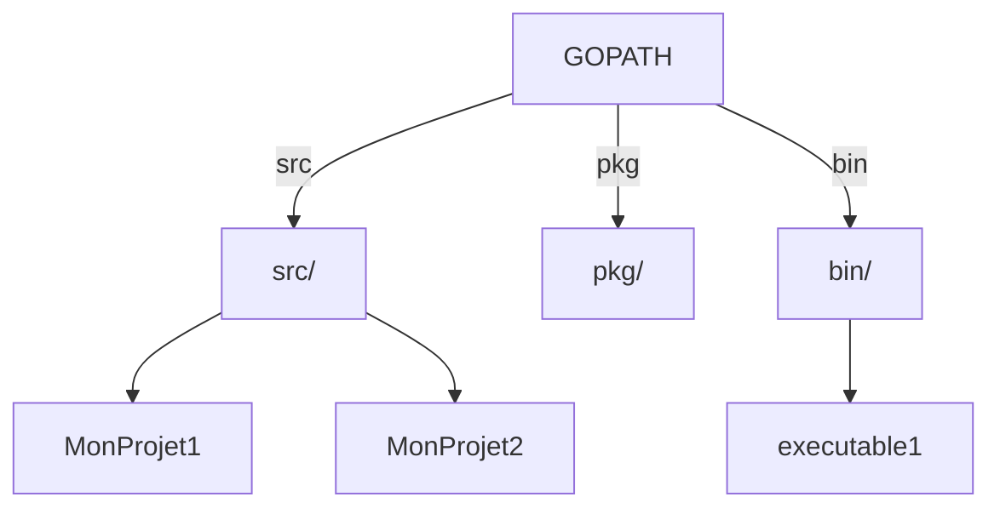

# Article 1-3-1 : Téléchargement, installation et configuration GOPATH, GOROOT

## 1-3-Installation et premiers programmes

### Introduction

Pour commencer à développer en Go, il est nécessaire d’installer correctement le langage, de configurer son environnement et de comprendre les variables clés GOPATH et GOROOT. Cet article décrit les étapes essentielles d’installation, configuration et premier programme pour vous assurer un bon départ avec Go.

---

## 1. Télécharger et installer Go

### Étapes d’installation

1. **Téléchargement officiel**

Le site officiel de Go fournit les distributions pour Windows, macOS et Linux :  
https://golang.org/dl/

Choisissez la version stable la plus récente adaptée à votre système d’exploitation. Par exemple, pour Linux x86_64, sélectionnez le fichier `go1.20.5.linux-amd64.tar.gz` (version courante au moment d'écrire).

2. **Installation sous Linux / macOS**

Extraction dans `/usr/local` (par défaut) :

```bash
sudo tar -C /usr/local -xzf go1.20.5.linux-amd64.tar.gz
```

Puis, ajoutez Go au PATH au niveau de votre profil shell (`~/.bashrc`, `~/.zshrc`):

```bash
export PATH=$PATH:/usr/local/go/bin
```

Chargez la configuration :

```bash
source ~/.bashrc
```

3. **Installation sous Windows**

Téléchargez l’installeur `.msi` et suivez les instructions. Le PATH est automatiquement configuré.

---

## 2. GOPATH et GOROOT : définitions et configuration

### GOROOT

- **Définit l'emplacement de l'installation du langage Go.**
- Contient la distribution du compilateur, la bibliothèque standard, etc.
- En général : `/usr/local/go` (Linux/macOS), `C:\Go` (Windows).
- **Ne doit pas être modifié sauf cas avancés.**

Pour vérifier :

```bash
go env GOROOT
```

### GOPATH

- **Définit le répertoire de travail pour vos projets Go, packages, binaires.**
- Par défaut : `$HOME/go` (Linux/macOS), `%USERPROFILE%\go` (Windows).
- Contient la structure suivante :

```
GOPATH/
 ├── bin/       # exécutables compilés
 ├── pkg/       # packages compilés
 └── src/       # source des projets
```

Définition typique dans `.bashrc` ou `.zshrc` :

```bash
export GOPATH=$HOME/go
export PATH=$PATH:$GOPATH/bin
```

Visualiser GOPATH :

```bash
go env GOPATH
```

---

## 3. Premier programme Go

Créons un programme simple `hello.go` :

```go
package main

import "fmt"

func main() {
    fmt.Println("Bonjour, Go !")
}
```

### Compilation et exécution

Placez ce fichier sous `$GOPATH/src/helloworld/`.

Puis dans la console :

```bash
cd $GOPATH/src/helloworld
go build
./helloworld
```

Cela affichera :

```
Bonjour, Go !
```

### Exécution directe sans build

```bash
go run hello.go
```

---

## 4. Organisation et workflow avec GOPATH (avant modules)



- **src :** code source.
- **pkg :** packages compilés.
- **bin :** exécutables.

**Note :** Depuis Go 1.11, le système de modules (`go mod`) a réduit la dépendance à GOPATH, facilitant la gestion des dépendances indépendamment du GOPATH.

---

## 5. Vérification de l’installation

Après installation et configuration, vérifier la version :

```bash
go version
```

Afficher toutes les variables d’environnement Go :

```bash
go env
```

---

## Conclusion

L’installation de Go est simple et rapide grâce aux distributions officielles. Les variables d’environnement **GOROOT** et **GOPATH** jouent un rôle clé dans le fonctionnement interne, mais on laisse habituellement GOROOT par défaut. GOPATH définit où résident vos projets et exécutables, bien que l’usage des modules ait réduit son importance.

Dès l’installation terminée, compiler et exécuter un premier programme permet de valider la configuration.

---

## Sources

- [Go.dev - Installation](https://go.dev/doc/install)
- [Go.dev - Environment Variables](https://go.dev/doc/gopath_code)
- [GOPATH vs GOROOT - Stack Overflow](https://stackoverflow.com/questions/23810836/what-are-the-goroot-and-gopath-environment-variables-in-golang)
- [Go Wiki - Setting GOPATH](https://github.com/golang/go/wiki/SettingGOPATH)

