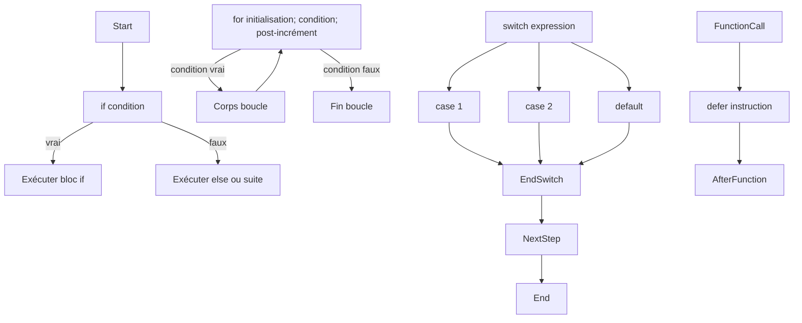

# Article 2-2-1 : Structures de contrôle en Go — if, for, switch, defer et leurs usages

## 2-2-Fondamentaux du langage – Structures de contrôle

### Introduction

Les structures de contrôle sont les mécanismes fondamentaux qui dirigent le flux d’exécution d’un programme. Go offre un ensemble simple et puissant : `if` pour la conditionnelle, `for` pour les boucles, `switch` pour les sélections multiples, et `defer` pour la gestion différée d’instructions, très utile pour la gestion des ressources.

---

## 1. La structure `if`

- Syntaxe classique avec ou sans accolades.
- La condition doit être une expression booléenne.
- Go autorise une instruction d’init avant la condition.

**Exemple sans init :**

```go
if x > 10 {
    fmt.Println("x est plus grand que 10")
}
```

**Exemple avec init :**

```go
if err := doSomething(); err != nil {
    fmt.Println("Erreur détectée :", err)
}
```

---

## 2. La boucle `for`

- `for` est la seule structure de boucle en Go, flexible et pouvant exprimer :
  - boucle `for` classique (initialisation, condition, post-incrément)
  - boucle `while` (condition seule)
  - boucle infinie (sans condition)
- Variables d’itération sont locales à la boucle.

**Boucle classique :**

```go
for i := 0; i < 5; i++ {
    fmt.Println(i)
}
```

**Boucle style while :**

```go
i := 0
for i < 5 {
    fmt.Println(i)
    i++
}
```

**Boucle infinie :**

```go
for {
    // Exécution répétée
}
```

---

## 3. La sélection `switch`

- Permet des tests multiples sur une valeur.
- Pas besoin de `break` explicite, Go sort automatiquement du switch après un case.
- Supporte les expressions dans les cases.
- Peut s’écrire sans expression, dans ce cas les cases sont évaluées comme des conditions booléennes.

**Switch sur valeur :**

```go
switch day {
case "Monday":
    fmt.Println("Début de semaine")
case "Friday":
    fmt.Println("Fin de semaine")
default:
    fmt.Println("Autre jour")
}
```

**Switch sans expression :**

```go
switch {
case x < 0:
    fmt.Println("Négatif")
case x == 0:
    fmt.Println("Zéro")
default:
    fmt.Println("Positif")
}
```

---

## 4. La gestion différée avec `defer`

- Permet de différer l’exécution d’une fonction jusqu’à la fin de la fonction englobante.
- Très utile pour fermer des fichiers, libérer des ressources, afficher des logs de fin.
- Plusieurs defer sont empilés (LIFO).

**Exemple simple :**

```go
func readFile() {
    file, err := os.Open("test.txt")
    if err != nil {
        fmt.Println("Erreur ouverture fichier:", err)
        return
    }
    defer file.Close()
    // traitement du fichier ici
    fmt.Println("Lecture terminée")
}
```

---

## 5. Exemples combinés

```go
package main

import (
    "fmt"
    "os"
)

func main() {
    for i := 0; i < 3; i++ {
        defer fmt.Println("Deferred:", i)
    }

    if err := doSomething(); err != nil {
        fmt.Println("Erreur :", err)
    }

    switch x := 2; x {
    case 1:
        fmt.Println("Un")
    case 2:
        fmt.Println("Deux")
    default:
        fmt.Println("Autre")
    }
}

func doSomething() error {
    file, err := os.Open("file.txt")
    if err != nil {
        return err
    }
    defer file.Close()
    // Traitement fichier...
    return nil
}
```

Exécution de `defer` affiche les sorties dans l’ordre inverse.

---

## 6. Diagramme Mermaid : Flux de contrôle



---

## Sources

- [Go by Example - If/Else](https://gobyexample.com/if-else)
- [Go by Example - For](https://gobyexample.com/for)
- [Go by Example - Switch](https://gobyexample.com/switch)
- [Go by Example - Defer](https://gobyexample.com/defer)
- [Golang official documentation - Flow control](https://golang.org/ref/spec#If_statements)
- [Effective Go - Defer](https://go.dev/doc/effective_go#defer)

---

Ces structures de contrôle fournissent une base solide et expressive pour piloter l’exécution d’un programme Go, tout en restant simples et lisibles. Le mot-clé `defer` ajoute une grande flexibilité pour la gestion sûre des ressources.