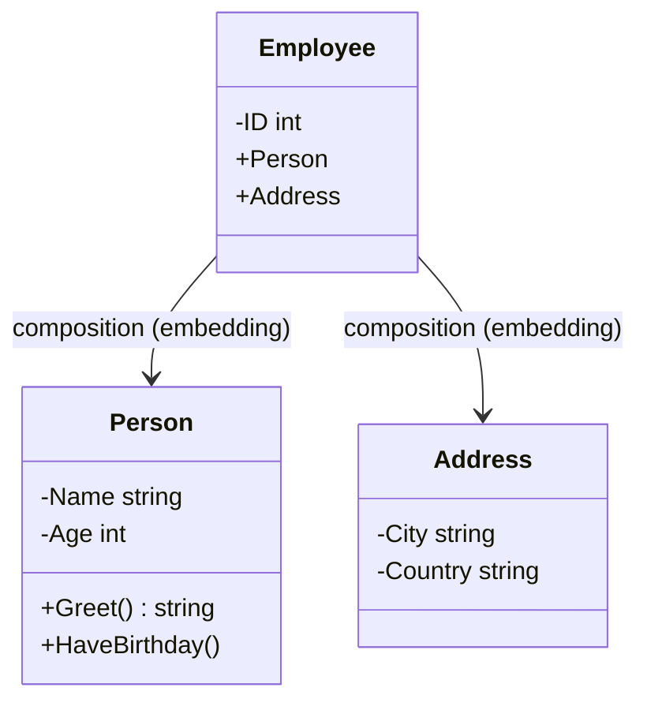

# Article 3-1-1 : Structs en Go - Définition, composition, méthodes associées et receiver

## 3-Programmation orientée structure en Go – Structs

### Introduction

En Go, la programmation orientée structure repose principalement sur les **structs**, types définis par l’utilisateur qui regroupent des champs nommés. Les structs permettent de modéliser des données composées et de leur associer des comportements via des méthodes attachées. Ce mécanisme offre une alternative légère à la programmation orientée objet classique.

---

## 1. Définition d’une struct

Une struct est une collection ordonnée de champs de types potentiellement différents.

**Syntaxe :**

```go
type Person struct {
    Name string
    Age  int
}
```

Cet exemple définit une struct `Person` avec deux champs : `Name` de type `string` et `Age` de type `int`.

**Instanciation :**

```go
p := Person{Name: "Alice", Age: 30}
```

---

## 2. Composition de structs

Go favorise la composition plutôt que l’héritage. Une struct peut inclure d’autres structs en tant que champs nommés ou sans nom (embedding) :

**Embedding :**

```go
type Address struct {
    City, Country string
}

type Employee struct {
    Person  // embedding de Person
    Address // embedding de Address
    ID      int
}
```

L’embedding permet à `Employee` d’accéder directement aux champs de `Person` et `Address` comme s’ils étaient membres propres :

```go
e := Employee{
    Person:  Person{Name: "Bob", Age: 40},
    Address: Address{City: "Paris", Country: "France"},
    ID:      123,
}
fmt.Println(e.Name)    // Accès à Person.Name
fmt.Println(e.City)    // Accès à Address.City
```

---

## 3. Méthodes associées aux structs

Les méthodes sont des fonctions associées à un type, définies avec un **receiver** qui désigne la variable de type struct.

**Syntaxe générale :**

```go
func (p Person) Greet() string {
    return "Bonjour, je m'appelle " + p.Name
}
```

Ici `p Person` est le receiver : la méthode `Greet()` est attachée au type `Person`.

**Appel de méthode :**

```go
person := Person{Name: "Alice"}
fmt.Println(person.Greet())  // Bonjour, je m'appelle Alice
```

---

## 4. Receivers : valeur vs pointeur

Le receiver peut être une **valeur** ou un **pointeur**.

- Receiver en valeur : la méthode travaille sur une copie. Les modifications ne modifient pas l’original.

- Receiver en pointeur : permet de modifier les champs du struct original.

**Exemple receiver valeur :**

```go
func (p Person) HaveBirthday() {
    p.Age += 1  // modifie la copie uniquement
}
```

**Exemple receiver pointeur :**

```go
func (p *Person) HaveBirthday() {
    p.Age += 1  // modifie l'instance d'origine
}
```

**Utilisation :**

```go
p := Person{Name: "Alice", Age: 29}
p.HaveBirthday()
fmt.Println(p.Age)  // 29 si receiver valeur, 30 si pointeur
```

---

## 5. Exemple complet

```go
package main

import "fmt"

type Person struct {
    Name string
    Age  int
}

func (p *Person) HaveBirthday() {
    p.Age++
}

func (p Person) Greet() string {
    return "Bonjour, je m'appelle " + p.Name
}

func main() {
    alice := Person{Name: "Alice", Age: 30}
    fmt.Println(alice.Greet())  // Bonjour, je m'appelle Alice

    alice.HaveBirthday()
    fmt.Println("Age après anniversaire :", alice.Age)  // 31
}
```

---

## 6. Diagramme Mermaid : struct, composition et méthodes



---

## 7. Sources

- [Go by Example - Structs](https://gobyexample.com/structs)
- [Go by Example - Methods](https://gobyexample.com/methods)
- [Effective Go - Methods](https://go.dev/doc/effective_go#methods)
- [Go Language Spec - Method declarations](https://golang.org/ref/spec#Method_declarations)
- [Go Wiki - Composition vs Inheritance](https://github.com/golang/go/wiki/CodeReviewComments#composition-vs-inheritance)

---

Structs, composition par embedding, et méthodes avec receiver forment le socle de la programmation orientée structure en Go, favorisant un design simple mais puissant, proche des besoins de structuration des données et comportements.