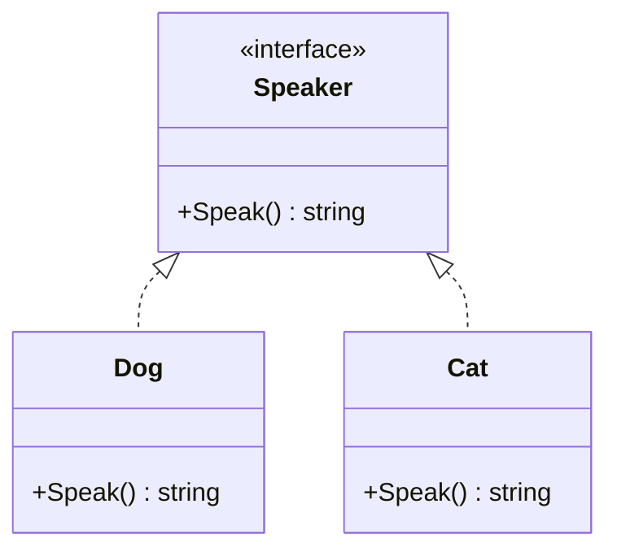

# Article 3-2-1 : Interfaces en Go - Duck Typing, interface vide et satisfaction implicite d’interfaces

## 3-Programmation orientée structure en Go – Interfaces

### Introduction

Les interfaces en Go incarnent une approche minimaliste et puissante de la programmation orientée structure. Contrairement aux concepts classiques d’héritage, Go s’appuie sur le **duck typing** et la **satisfaction implicite d’interfaces**, où la compatibilité d’un type avec une interface se fait automatiquement s’il implémente les méthodes requises. L’interface vide, quant à elle, représente un type universel capable d’accepter toute valeur.

---

## 1. Duck Typing en Go

Le **duck typing** (déduit du proverbe "If it walks like a duck and quacks like a duck, then it is a duck") signifie qu’un type est compatible avec une interface s’il possède les méthodes déclarées dans cette interface, sans qu’il soit nécessaire de déclarer explicitement cette compatibilité.

**Exemple :**

```go
type Speaker interface {
    Speak() string
}

type Dog struct{}

func (d Dog) Speak() string {
    return "Woof!"
}

type Cat struct{}

func (c Cat) Speak() string {
    return "Meow!"
}

func makeSpeak(s Speaker) {
    fmt.Println(s.Speak())
}

func main() {
    dog := Dog{}
    cat := Cat{}
    makeSpeak(dog)  // Woof!
    makeSpeak(cat)  // Meow!
}
```

Ici, ni `Dog` ni `Cat` ne déclarent explicitement qu’ils implémentent `Speaker`, mais ils sont compatibles car ils ont la méthode `Speak()`.

---

## 2. Interface vide (`interface{}`)

L’interface vide ne contient aucune méthode et est satisfaite par **tous** les types. Elle agit comme un type "universel".

**Usage :**

- Lorsqu’une fonction doit accepter n’importe quel type.
- Pour stocker des valeurs de types différents dans des slices ou maps.

**Exemple :**

```go
func printValue(v interface{}) {
    fmt.Println(v)
}

func main() {
    printValue(42)
    printValue("Go")
    printValue(struct{ Name string }{"Alice"})
}
```

---

## 3. Satisfaction implicite des interfaces

- Pas de mot-clé `implements` nécessaire en Go.
- Le compilateur vérifie automatiquement si un type possède toutes les méthodes d’une interface pour la satisfaire.
- Prévient la surcharge des annotations et rend la programmation plus flexible.

**Contrôle explicite (optionnel) :**

Pour rendre explicite qu’un type implémente une interface, on peut ajouter une assertion compilateur :

```go
var _ Speaker = Dog{}
```

Si `Dog` ne satisfait pas `Speaker`, la compilation échouera.

---

## 4. Exemple combiné

```go
package main

import "fmt"

type Stringer interface {
    String() string
}

type Person struct {
    Name string
    Age  int
}

func (p Person) String() string {
    return fmt.Sprintf("%s (%d ans)", p.Name, p.Age)
}

func printString(s Stringer) {
    fmt.Println(s.String())
}

func main() {
    p := Person{"Alice", 30}
    printString(p)

    var i interface{} = 10
    fmt.Println(i)  // Affiche 10, interface vide acceptant un int
}
```

---

## 5. Diagramme Mermaid : relation entre type et interfaces via duck typing



---

## 6. Sources

- [Go by Example - Interfaces](https://gobyexample.com/interfaces)
- [Go Blog - Interfaces](https://go.dev/blog/interface-values)
- [Official Go Specification - Interfaces](https://golang.org/ref/spec#Interface_types)
- [Effective Go - Interfaces](https://go.dev/doc/effective_go#interfaces)
- [Go Wiki - Interface Satisfaction](https://github.com/golang/go/wiki/InterfaceSatisfaction)

---

L’approche des interfaces en Go mélange simplicité et puissance via la satisfaction implicite et le duck typing, ouvrant des possibilités étendues pour la programmation modulaire et flexible. L’interface vide permet une gestion polymorphe sans contrainte stricte.