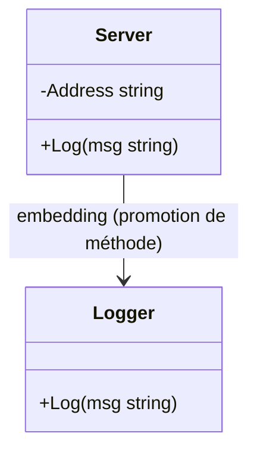

# Article 3-3-1 : Embedding en Go – Composition vs Héritage, promotion de méthodes, usages

## 3-Programmation orientée structure en Go – Embedding

### Introduction

Go ne propose pas d’héritage classique comme dans d’autres langages orientés objet. À la place, il privilégie la **composition** via l’**embedding** pour construire des types complexes à partir de types existants. Cette approche évite certains problèmes associés à l’héritage tout en offrant la **promotion de méthodes**, une forme pratique de délégation.

---

## 1. Composition vs Héritage

| Héritage (classique)                   | Composition (Go via embedding)                           |
|--------------------------------------|---------------------------------------------------------|
| Relation "est un" (is-a)              | Relation "a un" (has-a)                                 |
| Sous-classe dérivée à partir d’une super-classe | Un type inclut un autre type en champ (embedding)       |
| Héritage des données et comportements | Recyclage des comportements sans création hiérarchique  |
| Peut générer un couplage fort          | Plus flexible et découplé                                |

En Go, un struct peut **embeder** un autre struct, ce qui signifie que ses champs et méthodes sont automatiquement accessibles comme s’ils appartenaient directement au struct englobant (promotion).

---

## 2. Syntaxe de l’embedding

Un type est inclus dans un autre sans nommer explicitement le champ. Le type embarqué devient un champ anonyme.

```go
type Address struct {
    City, Country string
}

type Person struct {
    Name string
    Age  int
    Address  // embedding d’Address
}
```

---

## 3. Promotion de méthodes et champs

Les méthodes et champs du type embarqué sont **promus** dans le type englobant. On peut y accéder directement.

**Exemple :**

```go
func (a Address) FullAddress() string {
    return a.City + ", " + a.Country
}

p := Person{
    Name: "Alice",
    Age: 29,
    Address: Address{City: "Paris", Country: "France"},
}

fmt.Println(p.FullAddress())  // Accès direct à la méthode de Address
```

---

## 4. Résolution des conflits

Si plusieurs embeddings fournissent des méthodes du même nom, Go exige une résolution explicite.

```go
type A struct{}
func (A) Hello() { fmt.Println("Hello from A") }

type B struct{}
func (B) Hello() { fmt.Println("Hello from B") }

type C struct {
    A
    B
}

c := C{}
// c.Hello() // Erreur : ambigu car A et B ont Hello
c.A.Hello() // Résolution explicit
c.B.Hello()
```

---

## 5. Usages typiques

- **Réutilisation de code** : intégrer des comportements communs dans plusieurs structs sans héritage.
- **“Mixin” léger** : enrichir un struct avec des fonctionnalités.
- **Imiter une hiérarchie** minimaliste sans complexité.

---

## 6. Exemple complet

```go
package main

import "fmt"

type Logger struct{}

func (Logger) Log(msg string) {
    fmt.Println("Log:", msg)
}

type Server struct {
    Address string
    Logger  // embedding de Logger
}

func main() {
    s := Server{Address: "localhost:8080"}
    s.Log("Démarrage du serveur")  // Méthode promue du Logger
}
```

---

## 7. Diagramme Mermaid : relation embedding



---

## 8. Sources

- [Go by Example - Embedding](https://gobyexample.com/embedding)
- [Effective Go - Embedding](https://go.dev/doc/effective_go#embedding)
- [Go Blog - Composition using embedding](https://blog.golang.org/laws-of-reflection)
- [Go Language Specification - Struct types](https://golang.org/ref/spec#Struct_types)

---

L’**embedding** en Go offre un mécanisme simple et puissant de composition, favorisant la réutilisation via la promotion de méthodes, tout en évitant la complexité et les pièges liés à l’héritage classique.