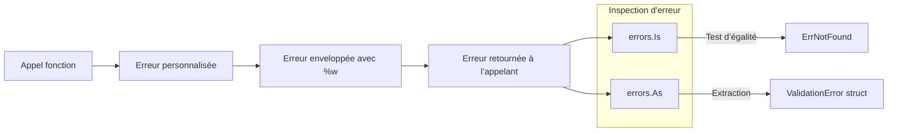

# Article 3-4-1 : Gestion des erreurs en Go – Pattern error, errors.Is / errors.As, erreurs personnalisées

## 3-Programmation orientée structure en Go – Gestion des erreurs

### Introduction

La gestion des erreurs en Go repose sur des conventions simples mais puissantes, centrées autour du type `error`. Pour manipuler efficacement les erreurs, Go propose plusieurs outils modernes : le pattern `error` standard, les fonctions `errors.Is` et `errors.As` pour l’inspection et le typage des erreurs, ainsi que la création d’erreurs personnalisées. Ces mécanismes facilitent un contrôle précis du flux d’erreur dans tout programme.

---

## 1. Le pattern error en Go

Le type `error` est une interface standard définie ainsi :

```go
type error interface {
    Error() string
}
```

Une fonction retourne souvent un deuxième résultat `error` pour signaler une erreur. Exemple :

```go
func Divide(a, b float64) (float64, error) {
    if b == 0 {
        return 0, fmt.Errorf("division par zéro")
    }
    return a / b, nil
}

result, err := Divide(10, 0)
if err != nil {
    fmt.Println("Erreur:", err)
}
```

Retourner `nil` dans `error` signifie absence d’erreur.

---

## 2. Inspecter les erreurs : errors.Is et errors.As

Pour des chaînes d’erreurs ou des erreurs personnalisées, on utilise `errors.Is` pour tester la cause et `errors.As` pour remonter à un type d’erreur précis.

### 2.1 errors.Is

- Permet de vérifier si une erreur imbriquée correspond à une erreur donnée.
- Utilisé souvent avec des erreurs pré-définies ou valeurs constantes.

```go
var ErrNotFound = errors.New("ressource non trouvée")

func find(id int) error {
    return fmt.Errorf("find %d: %w", id, ErrNotFound)
}

err := find(10)
if errors.Is(err, ErrNotFound) {
    fmt.Println("Erreur de type NotFound détectée")
}
```

La fonction `fmt.Errorf` avec `%w` permet d’enrouler (`wrap`) l’erreur.

### 2.2 errors.As

- Permet de récupérer une erreur spécifique dans une chaîne d’erreurs imbriquées.
- Utile avec des erreurs personnalisées structurées.

```go
type MyError struct {
    Code int
    Msg  string
}

func (e *MyError) Error() string {
    return e.Msg
}

func mayFail() error {
    return &MyError{Code: 404, Msg: "page non trouvée"}
}

var myErr *MyError
err := mayFail()
if errors.As(err, &myErr) {
    fmt.Println("Code erreur:", myErr.Code)
}
```

---

## 3. Création d’erreurs personnalisées

On crée un type qui implémente l’interface `error` pour enrichir les erreurs de contexte, codes ou champs supplémentaires.

```go
type ValidationError struct {
    Field   string
    Message string
}

func (e *ValidationError) Error() string {
    return fmt.Sprintf("Champ %s invalide: %s", e.Field, e.Message)
}

func validate(name string) error {
    if name == "" {
        return &ValidationError{Field: "Name", Message: "ne peut pas être vide"}
    }
    return nil
}

err := validate("")
if ve, ok := err.(*ValidationError); ok {
    fmt.Println("Erreur de validation:", ve)
}
```

---

## 4. Exemple complet combiné

```go
package main

import (
    "errors"
    "fmt"
)

var ErrNotFound = errors.New("ressource non trouvée")

type ValidationError struct {
    Field string
    Msg   string
}

func (e *ValidationError) Error() string {
    return fmt.Sprintf("Champ %s invalide: %s", e.Field, e.Msg)
}

func findResource(id int) error {
    return fmt.Errorf("find %d: %w", id, ErrNotFound)
}

func validateName(name string) error {
    if name == "" {
        return &ValidationError{Field: "Name", Msg: "ne peut pas être vide"}
    }
    return nil
}

func main() {
    err := findResource(42)
    if errors.Is(err, ErrNotFound) {
        fmt.Println("Erreur trouvée:", err)
    }

    err = validateName("")
    var ve *ValidationError
    if errors.As(err, &ve) {
        fmt.Println("ValidationError détectée:", ve)
    }
}
```

---

## 5. Diagramme Mermaid : chaîne d’erreurs et inspection



---

## 6. Sources

- [Go Blog - Error values](https://blog.golang.org/error-handling-and-go)
- [Pkg errors - errors.Is, errors.As](https://pkg.go.dev/errors)
- [Go by Example - Errors](https://gobyexample.com/errors)
- [Effective Go - Errors](https://go.dev/doc/effective_go#errors)
- [Go Wiki - Error handling and inspection](https://github.com/golang/go/wiki/ErrorHandling)

---

En résumé, Go propose un pattern error simple et efficace, enrichi avec `errors.Is` et `errors.As` pour une inspection fine, et la création d’erreurs personnalisées facilite la capture contextuelle et détaillée des erreurs. Utiliser ces outils améliore la robustesse et la maintenabilité du code.