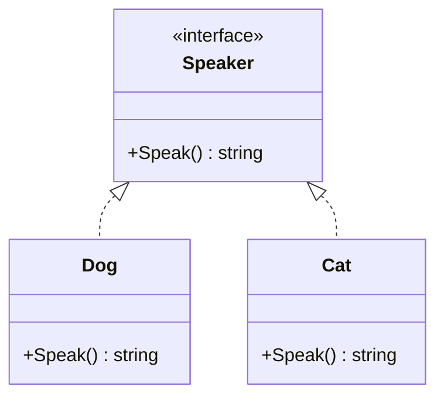

# Article 3-5-1 : Paradigme Go – Absence de classes, penser en termes de comportements et interfaces

## 3-Programmation orientée structure en Go – Paradigme Go

### Introduction

Go adopte un paradigme de programmation structuré autour des ** comportements** plutôt que des objets au sens classique, sans utiliser de classes ni d’héritage. La clef réside dans la définition d’**interfaces** et la composition de types via les **structs**, favorisant la flexibilité et la simplicité, tout en encourageant un code fortement découplé.

---

## 1. Go n’a pas de classes

Contrairement aux langages orientés objet classiques (Java, C++, C#), Go ne propose **pas de classes**. Il utilise :

- Des **structs** pour modéliser des données composites.
- Des **interfaces** pour décrire des comportements.

Les structs ne contiennent que des données, sans notion d’héritage.

---

## 2. Penser en termes de comportements via interfaces

Une **interface** décrit un ensemble de méthodes qu’un type doit implémenter pour satisfaire cette interface. Un type satisfait implicitement une interface simplement en implémentant ses méthodes, sans déclaration explicite.

**Exemple d’interface simple :**

```go
type Reader interface {
    Read(p []byte) (n int, err error)
}
```

Tout type possédant une méthode `Read([]byte) (int, error)` satisfait automatiquement cette interface.

---

## 3. Interface comme contrat comportemental

En Go, on ne pense pas "qu’est-ce que c’est ?" mais "qu’est-ce que ça peut faire ?". Par exemple, un objet n’est pas vu comme une “Voiture” (classe) mais comme un type qui peut “démarrer”, “accélérer”, “freiner” (comportements via interfaces).

Cela facilite la programmation modulaire et le polymorphisme :

```go
func PlaySound(p Player) {
    p.Play()
}

type Player interface {
    Play()
}

type MP3Player struct{}

func (m MP3Player) Play() {
    fmt.Println("Lecture MP3")
}

type CDPlayer struct{}

func (c CDPlayer) Play() {
    fmt.Println("Lecture CD")
}
```

---

## 4. Composition et réutilisation

Au lieu d’héritage, Go utilise la **composition** via l’embedding de structs. Elle permet de construire des types complexes en combinant d’autres types et leurs méthodes.

---

## 5. Exemple complet

```go
package main

import "fmt"

type Speaker interface {
    Speak() string
}

type Dog struct{}

func (d Dog) Speak() string {
    return "Woof"
}

type Cat struct{}

func (c Cat) Speak() string {
    return "Meow"
}

func makeSpeak(s Speaker) {
    fmt.Println(s.Speak())
}

func main() {
    var s Speaker

    s = Dog{}
    makeSpeak(s)

    s = Cat{}
    makeSpeak(s)
}
```

---

## 6. Diagramme Mermaid : paradigme Go orienté comportement



---

## 7. Sources

- [Go by Example - Interfaces](https://gobyexample.com/interfaces)
- [Effective Go - Interfaces](https://go.dev/doc/effective_go#interfaces)
- [Go Blog - Interfaces](https://go.dev/blog/interface-values)
- [Go Language Specification - Interface types](https://golang.org/ref/spec#Interface_types)

---

Go incite à concevoir les programmes comme un ensemble de types décrivant **ce qu’ils font**, non ce qu’ils sont, éliminant les contraintes de l’héritage classique tout en conservant puissance et expressivité via interfaces et composition.