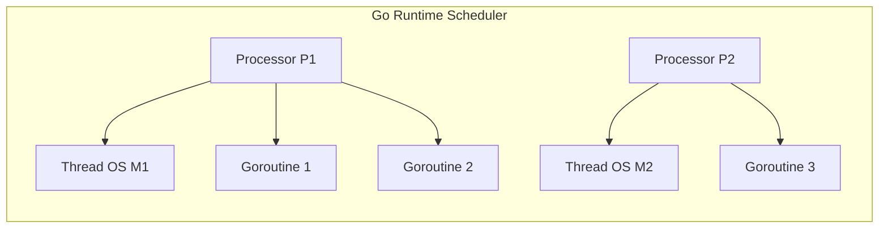

# Article 4-1-1 : Goroutines et Scheduler en Go – Création, cycle de vie, fonctionnement M:N threading

## 4-Concurrence en Go – Goroutines et scheduler

### Introduction

Go propose un modèle de concurrence efficace basé sur les **goroutines**, légères unités d'exécution multiplexées par un scheduler intégré. Plutôt que d’utiliser un thread par tâche, Go utilise un **modèle M:N** où plusieurs goroutines (M) sont mappées sur un nombre limité de threads système (N), optimisant ainsi l’utilisation des ressources.

---

## 1. Création d’une goroutine

Une goroutine est créée par simple ajout du mot-clé `go` devant un appel de fonction. Elle s’exécute de façon concurrente, en arrière-plan.

**Exemple minimal :**

```go
func sayHello() {
    fmt.Println("Hello from goroutine")
}

func main() {
    go sayHello()  // lancement d’une goroutine
    time.Sleep(time.Second) // attendre pour observer sortie
}
```

À la différence d’un thread système, la création d’une goroutine est très rapide (quelques kilo-octets de pile initiale) et peu coûteuse en mémoire.

---

## 2. Cycle de vie d’une goroutine

- **Création :** via `go func() { ... }()`
- **Exécution :** planifiée par le scheduler Go
- **Blocage :** si la goroutine attend une ressource, un canal, ou via un appel bloquant
- **Extinction :** lorsqu’elle termine sa fonction

Go gère dynamiquement la pile mémoire des goroutines, qui peut grandir ou diminuer pendant leur cycle.

---

## 3. Fonctionnement du scheduler (M:N threading)

Go utilise un scheduler intégré multiplexant **M goroutines** sur **N threads système**.

- **G (goroutine) :** unité d’exécution logique
- **M (machine OS) :** thread système réel
- **P (processor) :** ressource logique d’exécution qui possède un contexte permettant d’exécuter des G sur un M


Le scheduler organise ainsi :

- Plusieurs goroutines sont prêtes à tourner et placées dans une queue par P.
- Chaque P est associé à un thread OS (M) qui exécute les goroutines.
- Si une goroutine est bloquée (ex : IO), Go déplace une autre goroutine prête pour une exécution efficace.

---

## 4. Caractéristiques clés

- **Empilement dynamique :** la pile commence à petite taille (~2 KB) et s’agrandit/incline automatiquement.
- **Équilibrage de charge :** le scheduler répartit le travail entre P+M de façon concurrente.
- **Prise en charge du parallélisme :** le runtime permet d’augmenter le nombre de P (via `runtime.GOMAXPROCS`) pour utiliser plusieurs cœurs.

---

## 5. Exemple illustratif

```go
package main

import (
    "fmt"
    "runtime"
    "sync"
)

func worker(id int, wg *sync.WaitGroup) {
    defer wg.Done()
    fmt.Printf("Worker %d starting\n", id)
    for i := 0; i < 3; i++ {
        fmt.Printf("Worker %d working %d\n", id, i)
        runtime.Gosched()  // yield pour permettre au scheduler de switcher
    }
    fmt.Printf("Worker %d done\n", id)
}

func main() {
    runtime.GOMAXPROCS(2)  // utiliser 2 threads OS

    var wg sync.WaitGroup

    for i := 1; i <= 3; i++ {
        wg.Add(1)
        go worker(i, &wg)
    }
    wg.Wait()
}
```

---

## 6. Diagramme Mermaid : modèle M:N scheduling



---

## 7. Sources

- [Go Blog - Goroutines](https://blog.golang.org/goroutines)
- [Go Blog - The Go Scheduler](https://blog.golang.org/scheduler)
- [Go source code - runtime](https://github.com/golang/go/tree/master/src/runtime)
- [Effective Go - Concurrency](https://go.dev/doc/effective_go#concurrency)
- [Go by Example - Goroutines](https://gobyexample.com/goroutines)

---

Le modèle M:N, avec ses goroutines légères et son scheduler intégré, permet à Go de gérer efficacement la concurrence, en optimisant l’utilisation des threads système sans surcharge importante, tout en garantissant simplicité et scalabilité.