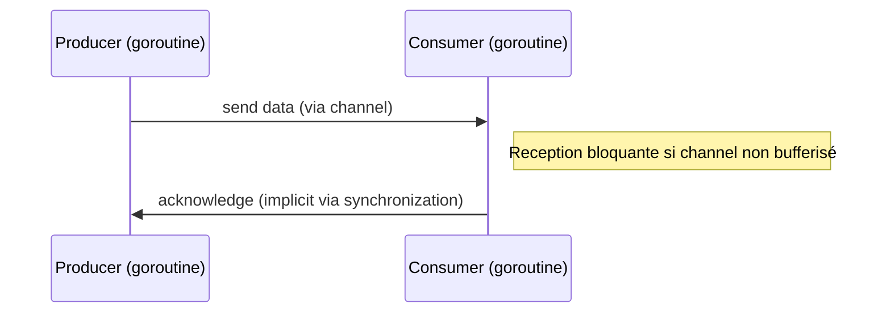

# Article 4-2-1 : Channels en Go – Unbuffered, buffered, directionnels, usages typiques

## 4-Concurrence en Go – Channels

### Introduction

Les **channels** sont un mécanisme fondamental en Go pour la synchronisation et la communication entre **goroutines**. Ils permettent l’échange sécurisé et ordonné de données à travers un concept proche des "pipes". Go distingue plusieurs types de channels selon leur capacité (buffered ou non) et leur direction (lecture, écriture).

---

## 1. Channels non bufferisés (unbuffered)

Un **channel non bufferisé** est un canal où chaque envoi (`chan <-`) attend qu’un récepteur (`<- chan`) soit prêt à recevoir la donnée, et vice versa. Cela assure une synchronisation stricte entre l’émetteur et le récepteur.

```go
ch := make(chan int) // channel non bufferisé

go func() {
    ch <- 42  // envoi bloquant jusqu'à ce que quelqu'un lise
}()

val := <-ch  // réception (bloquante si rien n’est envoyé)
fmt.Println(val) // 42
```

Cet échange bloquant garantit que la donnée est transférée de façon synchrone.

---

## 2. Channels bufferisés (buffered)

Un **channel bufferisé** possède une capacité N, ce qui signifie qu’il peut stocker N éléments sans que l’émetteur soit bloqué, tant que le buffer n’est pas plein. Le récepteur peut lire plus tard.

```go
ch := make(chan int, 2) // channel bufferisé de capacité 2

ch <- 1 // non bloquant (buffer vide)
ch <- 2 // non bloquant (buffer à moitié plein)

val1 := <-ch
val2 := <-ch
fmt.Println(val1, val2) // 1 2
```

L’usage du buffer améliore la flexibilité et les performances, en réduisant la nécessité de synchronisation stricte.

---

## 3. Channels directionnels

Go permet de restreindre un channel à une **direction unique** afin de clarifier l’intention du code :

- `chan<- T` : channel en écriture seule
- `<-chan T` : channel en lecture seule

Cela renforce la sécurité et la lisibilité.

```go
func send(ch chan<- int, val int) {
    ch <- val  // ne peut qu’écrire
}

func receive(ch <-chan int) int {
    return <-ch  // ne peut que lire
}
```

Cette typage réduit les erreurs accidentelles de lecture ou écriture.

---

## 4. Usages typiques

- **Synchronisation** : garantir qu’une goroutine attend une autre (via un channel non bufferisé).
- **Communication** : transmettre des données entre goroutines.
- **Pipeline** : chaîner plusieurs étapes de traitement via des channels.

---

## 5. Exemple complet

```go
package main

import (
    "fmt"
    "time"
)

func producer(ch chan<- int) {
    for i := 1; i <= 3; i++ {
        fmt.Printf("Producing %d\n", i)
        ch <- i
        time.Sleep(300 * time.Millisecond)
    }
    close(ch)
}

func consumer(ch <-chan int) {
    for val := range ch {
        fmt.Printf("Consumed %d\n", val)
    }
}

func main() {
    ch := make(chan int, 2) // buffered channel

    go producer(ch)
    consumer(ch)
}
```

**Sortie :**

```
Producing 1
Consumed 1
Producing 2
Consumed 2
Producing 3
Consumed 3
```

---

## 6. Diagramme Mermaid – communication via channels



---

## 7. Sources

- [Go Blog - Go Concurrency Patterns: Pipelines and cancellations](https://blog.golang.org/pipelines)
- [Go by Example - Channels](https://gobyexample.com/channels)
- [Official Go Specification - Channels](https://golang.org/ref/spec#Channel_types)
- [Effective Go - Concurrency](https://go.dev/doc/effective_go#channels)

---

En résumé, les channels constituent un outil de communication et synchronisation élégant assurant l’échange contrôlé d’informations entre goroutines. La distinction entre channels bufferisés et non bufferisés permet d’adapter le modèle pour obtenir la concurrence la plus efficace selon les besoins. Le typage directionnel renforce la robustesse du code.