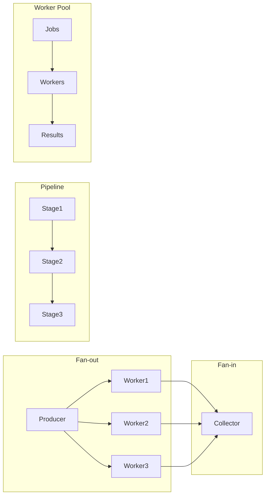

# Article 4-3-1 : Patterns de concurrence en Go – Fan-out, fan-in, pipeline, worker pool

## 4-Concurrence en Go – Patterns de concurrence

### Introduction

Go facilite la construction de systèmes concurrents robustes grâce à plusieurs **patterns** classiques utilisant les outils natifs comme les goroutines et les channels. Parmi ces patterns essentiels figurent le **fan-out**, le **fan-in**, le **pipeline** et le **worker pool**, qui permettent de structurer efficacement le traitement concurrent et la synchronisation des tâches.

---

## 1. Fan-out

Le **fan-out** consiste à créer plusieurs goroutines pour exécuter des tâches en parallèle et ainsi augmenter le débit.

**Exemple simplifié :** lancer plusieurs travailleurs pour traiter des entiers

```go
func worker(id int, jobs <-chan int, results chan<- int) {
    for j := range jobs {
        fmt.Printf("Worker %d traite job %d\n", id, j)
        results <- j * 2
    }
}

func main() {
    jobs := make(chan int, 5)
    results := make(chan int, 5)

    // Démarrage de 3 workers en fan-out
    for w := 1; w <= 3; w++ {
        go worker(w, jobs, results)
    }

    // Envoi des jobs
    for j := 1; j <= 5; j++ {
        jobs <- j
    }
    close(jobs)

    // Récupération des résultats
    for a := 1; a <= 5; a++ {
        fmt.Println("Résultat:", <-results)
    }
}
```

---

## 2. Fan-in

Le **fan-in** consiste à agréger les sorties de plusieurs goroutines dans un seul channel, facilitant ainsi la collecte et la gestion des résultats.

On utilise souvent plusieurs canaux d'entrée regroupés en un seul canal de sortie via une fonction dédiée.

**Exemple simple de fan-in :**

```go
func fanIn(cs ...<-chan int) <-chan int {
    out := make(chan int)
    var wg sync.WaitGroup
    wg.Add(len(cs))

    for _, c := range cs {
        go func(ch <-chan int) {
            defer wg.Done()
            for v := range ch {
                out <- v
            }
        }(c)
    }

    go func() {
        wg.Wait()
        close(out)
    }()
    return out
}
```

---

## 3. Pipeline

Le **pipeline** crée une chaîne de traitement par étapes, chaque étape exécutée dans une goroutine recevant et envoyant des données sur un channel.

**Exemple de pipeline** avec deux étapes : génération puis multiplication.

```go
func gen(nums ...int) <-chan int {
    out := make(chan int)
    go func() {
        for _, n := range nums {
            out <- n
        }
        close(out)
    }()
    return out
}

func sq(in <-chan int) <-chan int {
    out := make(chan int)
    go func() {
        for n := range in {
            out <- n * n
        }
        close(out)
    }()
    return out
}

func main() {
    nums := gen(2, 3, 4)
    squares := sq(nums)

    for n := range squares {
        fmt.Println(n)
    }
}
```

---

## 4. Worker Pool

Le **worker pool** est une forme spécialisée de fan-out où un nombre fixe de goroutines partagent la charge des jobs envoyés sur un channel, évitant la surcharge des ressources.

**Exemple :**

```go
func worker(id int, jobs <-chan int, results chan<- int) {
    for j := range jobs {
        fmt.Printf("Worker %d démarrage job %d\n", id, j)
        time.Sleep(time.Second) // simuler travail
        results <- j * 2
        fmt.Printf("Worker %d terminé job %d\n", id, j)
    }
}

func main() {
    const numJobs = 5
    jobs := make(chan int, numJobs)
    results := make(chan int, numJobs)

    // Démarrage de 3 workers
    for w := 1; w <= 3; w++ {
        go worker(w, jobs, results)
    }

    // Envoi des jobs
    for j := 1; j <= numJobs; j++ {
        jobs <- j
    }
    close(jobs)

    // Collecte des résultats
    for a := 1; a <= numJobs; a++ {
        fmt.Println("Résultat:", <-results)
    }
}
```

---

## 5. Diagramme Mermaid – Vue globale des patterns



---

## 6. Sources

- [Go Blog - Go Concurrency Patterns: Pipelines and cancellations](https://blog.golang.org/pipelines)
- [Go by Example - Worker Pools](https://gobyexample.com/worker-pools)
- [Effective Go - Concurrency Patterns](https://go.dev/doc/effective_go#concurrency)
- [Go Wiki - Concurrency Patterns](https://github.com/golang/go/wiki/Concurrency)

---

Ces patterns – fan-out, fan-in, pipeline et worker pool – fournissent des bases robustes pour organiser la concurrence en Go. Leur compréhension permet de bâtir des applications concurrentes performantes, simples à maintenir et faciles à faire évoluer.