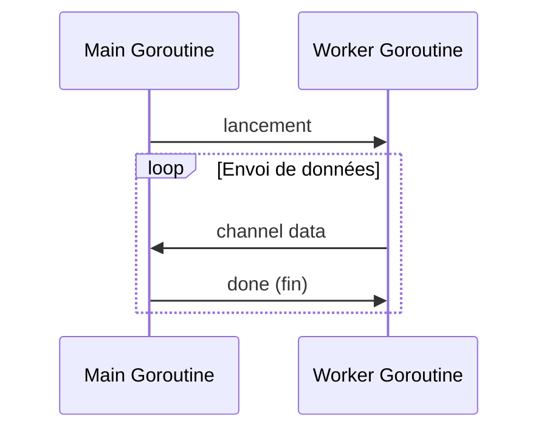

# Article 4-4-1 : Select en Go – Multiplexage de channels pour gérer la concurrence

## 4-Concurrence en Go – Select

### Introduction

Le mot-clé `select` est un outil natif de Go permettant de **multiplexer des opérations sur plusieurs channels**. Il permet à une goroutine d’attendre simultanément sur plusieurs communications, réagissant dès qu’une des opérations devient disponible. Ce mécanisme simplifie la gestion concurrente, la synchronisation et la coordination entre goroutines.

---

## 1. Fonctionnement de `select`

La syntaxe ressemble à un `switch`, mais pour les opérations de communication sur channels :

```go
select {
case msg1 := <-ch1:
    // traiter msg1
case ch2 <- msg2:
    // envoyer msg2 dans ch2
default:
    // exécuter si aucun case prêt (optionnel)
}
```

- Chaque `case` correspond à une opération de réception ou d’envoi.
- `select` bloque jusqu’à ce qu’au moins un des canaux soit prêt.
- Si plusieurs canaux sont prêts simultanément, l’un est choisi aléatoirement.
- Le `default` permet de ne pas bloquer si aucune communication n’est prête.

---

## 2. Exemple simple d’attente sur plusieurs canaux

```go
package main

import (
    "fmt"
    "time"
)

func main() {
    ch1 := make(chan string)
    ch2 := make(chan string)

    go func() {
        time.Sleep(1 * time.Second)
        ch1 <- "message de ch1"
    }()
    go func() {
        time.Sleep(2 * time.Second)
        ch2 <- "message de ch2"
    }()

    for i := 0; i < 2; i++ {
        select {
        case msg := <-ch1:
            fmt.Println("Reçu :", msg)
        case msg := <-ch2:
            fmt.Println("Reçu :", msg)
        }
    }
}
```

Ce code attend, à tour de rôle, les messages des deux channels en gérant les arrivées selon leur disponibilité.

---

## 3. Utilisations courantes du `select`

- **Timeouts :** combiner des opérations avec un timeout via un channel `time.After`.
- **Multiplexage d’événements** depuis différentes sources concurrentes.
- **Gestion d’interruptions propres** ou annulation via un canal `done`.
- **Implémentation de sélecteurs dans des architectures concurrentes complexes.**

---

## 4. Exemple avec timeout

```go
select {
case res := <-resultChan:
    fmt.Println("Résultat reçu:", res)
case <-time.After(500 * time.Millisecond):
    fmt.Println("Timeout atteint")
}
```

Cette construction évite de bloquer indéfiniment une goroutine.

---

## 5. Exemple plus complet : multiplexage avec annulation

```go
func worker(done <-chan struct{}, ch chan<- int) {
    for i := 0; ; i++ {
        select {
        case ch <- i:
            time.Sleep(100 * time.Millisecond)
        case <-done:
            fmt.Println("Worker arrêté")
            return
        }
    }
}

func main() {
    ch := make(chan int)
    done := make(chan struct{})

    go worker(done, ch)

    for i := 0; i < 5; i++ {
        fmt.Println("Reçu:", <-ch)
    }
    close(done) // signal d'arrêt au worker
    time.Sleep(time.Second) // attendre l'arrêt
}
```

Ici `select` permet au worker de choisir entre envoyer une valeur ou arrêter proprement lorsqu’on ferme le channel `done`.

---

## 6. Diagramme Mermaid – flux avec `select`



---

## 7. Sources

- [Go Blog - Go's select statement](https://blog.golang.org/select)
- [Go by Example - Select](https://gobyexample.com/select)
- [The Go Programming Language Specification - Select statements](https://golang.org/ref/spec#Select_statements)
- [Effective Go - Concurrency](https://go.dev/doc/effective_go#select)

---

Avec `select`, Go offre un mécanisme concis, puissant et flexible pour gérer la concurrence et le multiplexage d’opérations sur channels, facilitant l’écriture de programmes concurrentiels fiables et responsives.