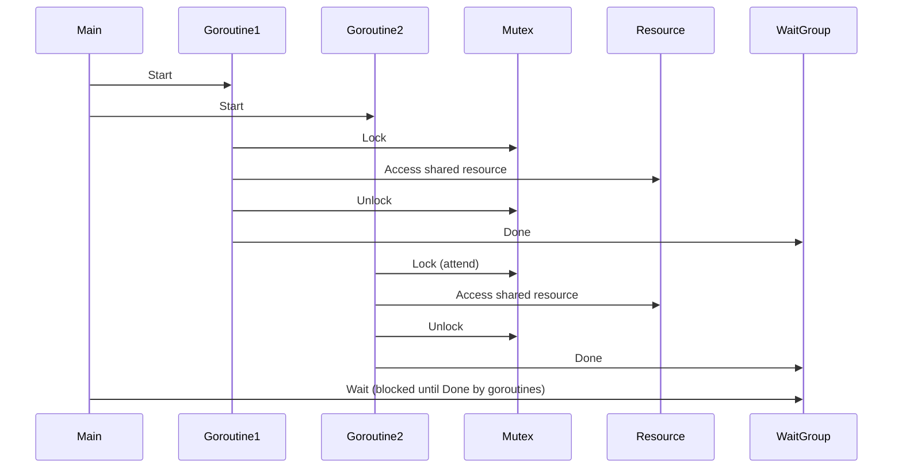

# Article 4-5-1 : Synchronisation bas niveau en Go – sync.Mutex, sync.WaitGroup, sync.Once

## 4-Concurrence en Go – Synchronisation bas niveau

### Introduction

Dans la programmation concurrente, la **synchronisation** permet de contrôler l’accès à des ressources partagées, et de coordonner le comportement des goroutines. Go offre dans son package `sync` des primitives simples et efficaces : **Mutex**, **WaitGroup**, et **Once**. Chacune remplit un rôle distinct dans la gestion fine de la concurrence.

---

## 1. sync.Mutex – verrou d’exclusion mutuelle

Le `Mutex` (verrou) protège une ressource partagée contre un accès concurrent non contrôlé.

- **Lock()** : verrouille le Mutex (bloque si déjà verrouillé).
- **Unlock()** : déverrouille le Mutex.

**Exemple :**

```go
package main

import (
    "fmt"
    "sync"
)

var (
    counter int
    mu sync.Mutex
)

func increment(wg *sync.WaitGroup) {
    defer wg.Done()
    mu.Lock()
    counter++
    mu.Unlock()
}

func main() {
    var wg sync.WaitGroup

    for i := 0; i < 1000; i++ {
        wg.Add(1)
        go increment(&wg)
    }

    wg.Wait()
    fmt.Println("Counter =", counter) // attendu : 1000
}
```

Sans mutex, des conditions de course peuvent corrompre la valeur partagée.

---

## 2. sync.WaitGroup – attendre un groupe de goroutines

Le `WaitGroup` synchronise une goroutine principale avec plusieurs goroutines concurrentes.

- **Add(n int)** : ajoute ou retire le nombre de goroutines à attendre.
- **Done()** : décrémente le compteur de goroutines attendues (souvent appelé dans un `defer`).
- **Wait()** : bloque jusqu’à ce que le compteur soit nul.

**Exemple :**

```go
var wg sync.WaitGroup

func worker(id int) {
    defer wg.Done()
    fmt.Printf("Worker %d starting\n", id)
    // simulate work
    time.Sleep(time.Second)
    fmt.Printf("Worker %d done\n", id)
}

func main() {
    for i := 1; i <= 3; i++ {
        wg.Add(1)
        go worker(i)
    }
    wg.Wait() // attend la fin des 3 workers
}
```

---

## 3. sync.Once – exécuter une action une seule fois

`Once` garantit qu’une fonction donnée ne s’exécute qu’une fois, quel que soit le nombre d’appels concurrents.

- **Do(f func())** : exécute `f` une seule fois.

**Exemple :**

```go
var once sync.Once

func initialize() {
    fmt.Println("Initialisation unique")
}

func main() {
    for i := 0; i < 5; i++ {
        go func() {
            once.Do(initialize)
        }()
    }
    time.Sleep(time.Second)
}
```

Quel que soit le nombre de goroutines, `initialize()` ne s'exécutera qu’une fois.

---

## 4. Diagramme Mermaid – synchronisation bas niveau



---

## 5. Sources

- [Package sync - Go documentation](https://pkg.go.dev/sync)
- [Go Blog - Go Concurrency Patterns](https://blog.golang.org/concurrency-timeout)
- [Go by Example - Mutex](https://gobyexample.com/mutex)
- [Go by Example - WaitGroups](https://gobyexample.com/waitgroups)
- [Go by Example - Once](https://gobyexample.com/once)

---

Ces primitives de bas niveau apportent un contrôle précis et sûr sur les interactions concurrentes, clé pour éviter les corruptions d’état et garantir des exécutions ordonnées dans vos programmes Go.