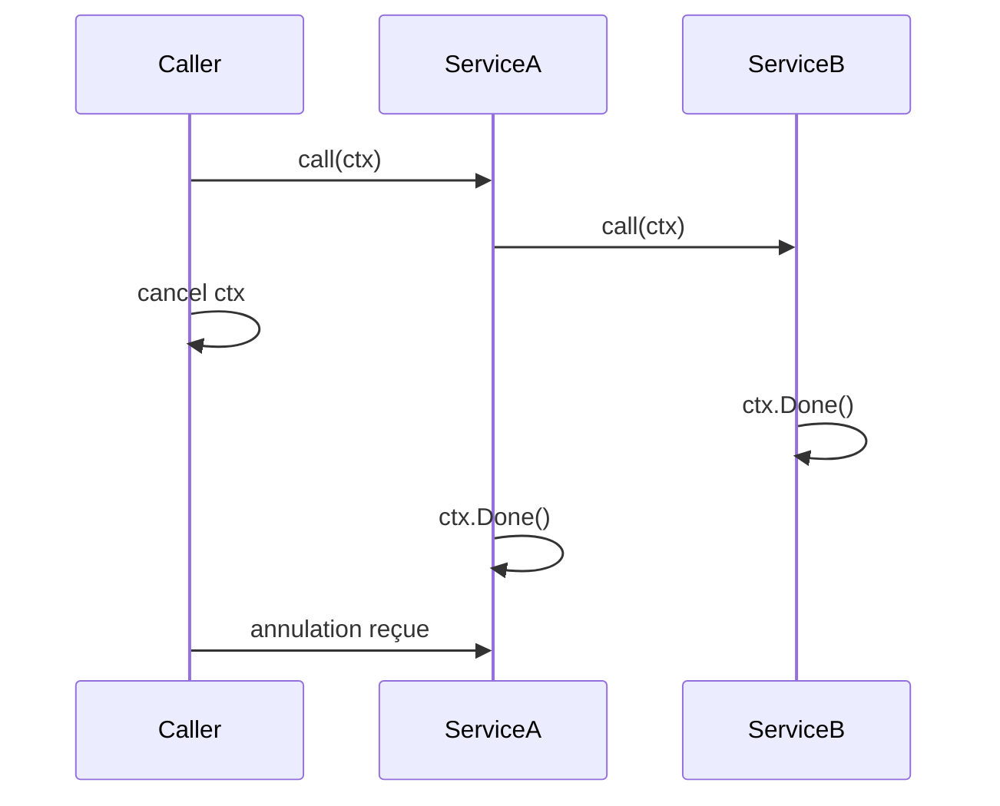

# Article 4-6-1 : Context en Go – Annulation, timeout et propagation dans les services

## 4-Concurrence en Go – Context

### Introduction

Le package `context` de Go est conçu pour gérer l’annulation, les timeouts, et la propagation de signaux entre goroutines et services. Il facilite l’écriture de programmes concurrentiels réactifs et contrôlés, notamment en environnement distribué ou dans la gestion des appels réseau.

---

## 1. Le rôle du `context.Context`

Un contexte (`context.Context`) encapsule des données de contrôle, telles que :

- **annulation** (cancel)
- **timeout**
- **valeurs associées** (pour passage de métadonnées)
- **propagation** dans les chaînes d’appels

Il est immuable et toujours passé explicitement en premier paramètre d’une fonction.

---

## 2. Création et annulation de contextes

Voici un exemple simple avec annulation manuelle :

```go
ctx, cancel := context.WithCancel(context.Background())

go func() {
    time.Sleep(2 * time.Second)
    cancel() // annulation déclenchée
}()

select {
case <-time.After(5 * time.Second):
    fmt.Println("Terminé sans annulation")
case <-ctx.Done():
    fmt.Println("Annulé:", ctx.Err()) // ctx.Err() renvoie context.Canceled
}
```

---

## 3. Timeout intégré dans Context

`context.WithTimeout` crée un contexte qui s’annule automatiquement après un délai.

```go
ctx, cancel := context.WithTimeout(context.Background(), 3*time.Second)
defer cancel()

select {
case <-time.After(5 * time.Second):
    fmt.Println("Travail terminé")
case <-ctx.Done():
    fmt.Println("Timeout :", ctx.Err()) // context.DeadlineExceeded
}
```

---

## 4. Propagation du contexte dans les appels

Les fonctions et services doivent recevoir le contexte pour propager annulation et deadlines.

```go
func doWork(ctx context.Context) {
    select {
    case <-ctx.Done():
        fmt.Println("Travail annulé:", ctx.Err())
        return
    case <-time.After(10 * time.Second):
        fmt.Println("Travail terminé")
    }
}

func main() {
    ctx, cancel := context.WithTimeout(context.Background(), 5*time.Second)
    defer cancel()

    go doWork(ctx)
    time.Sleep(6 * time.Second)
}
```

---

## 5. Passage de valeurs dans le contexte

Utilisez `context.WithValue` pour injecter des métadonnées, qui doivent être immuables et uniquement pour des données transversales.

```go
type key string

func main() {
    ctx := context.WithValue(context.Background(), key("userID"), "12345")

    process(ctx)
}

func process(ctx context.Context) {
    userID := ctx.Value(key("userID")).(string)
    fmt.Println("User ID:", userID)
}
```

---

## 6. Diagramme Mermaid – propagation et annulation via context



---

## 7. Sources

- [Package context - documentation officielle](https://pkg.go.dev/context)
- [Go Blog - Context](https://blog.golang.org/context)
- [Go by Example - Context](https://gobyexample.com/context)
- [Effective Go - Concurrency](https://go.dev/doc/effective_go#context)

---

Le package `context` est indispensable pour écrire des applications Go qui respectent les contraintes de temps, d’annulation et de propagation d’état, particulièrement dans les architectures modernes distribuées et concurrentes. Son usage explicite garantit un contrôle fin du cycle de vie des goroutines et des appels.