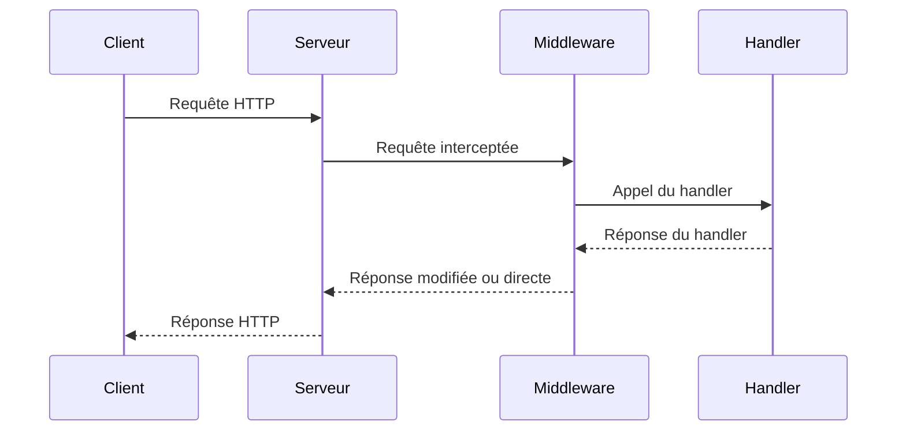

# Article 5-1-1 : Développement d'API REST en Go – net/http, routage, middleware, handlers

## 5-Développement backend et exposition de services – Développement d'API REST

### Introduction

Go propose une bibliothèque standard **net/http** robuste et performante, idéale pour construire des **API REST** simples à complexes. Maîtriser l’utilisation de `net/http` avec les concepts fondamentaux de **handlers**, de **routage** et de **middleware** est fondamental pour développer des services backend efficaces.

---

## 1. Utiliser `net/http` pour créer un serveur HTTP

Le package `net/http` contient les fonctions clés pour écouter sur un port, gérer les requêtes, et envoyer des réponses.

```go
package main

import (
    "fmt"
    "net/http"
)

func helloHandler(w http.ResponseWriter, r *http.Request) {
    fmt.Fprintf(w, "Bonjour, API REST en Go !")
}

func main() {
    http.HandleFunc("/", helloHandler)
    http.ListenAndServe(":8080", nil)
}
```

Ce serveur répond "Bonjour, API REST en Go !" à toute requête sur la racine `/`.

---

## 2. Handlers et HandlerFunc

Une **handler** en Go est un type qui implémente l’interface `http.Handler` :

```go
type Handler interface {
    ServeHTTP(ResponseWriter, *Request)
}
```

`http.HandleFunc` permet d’utiliser une fonction simple comme handler via un adaptateur.

---

## 3. Routage simple avec `http.ServeMux`

Le multiplexeur (`ServeMux`) permet de router les URL vers des handlers spécifiques :

```go
mux := http.NewServeMux()
mux.HandleFunc("/users", usersHandler)
mux.HandleFunc("/products", productsHandler)
http.ListenAndServe(":8080", mux)
```

---

## 4. Middleware en Go

Un **middleware** est une fonction qui enveloppe un handler pour ajouter un comportement transversal (logging, authentification, gestion des erreurs, CORS, etc.).

**Exemple de middleware simple de logging :**

```go
func loggingMiddleware(next http.Handler) http.Handler {
    return http.HandlerFunc(func(w http.ResponseWriter, r *http.Request) {
        fmt.Printf("Requête %s %s\n", r.Method, r.URL.Path)
        next.ServeHTTP(w, r)
    })
}

func main() {
    mux := http.NewServeMux()
    mux.HandleFunc("/hello", helloHandler)

    loggedMux := loggingMiddleware(mux)

    http.ListenAndServe(":8080", loggedMux)
}
```

---

## 5. Exemple complet : API REST simple avec routeurs et middleware

```go
package main

import (
    "encoding/json"
    "log"
    "net/http"
)

type User struct {
    ID int `json:"id"`
    Name string `json:"name"`
}

var users = []User{{1, "Alice"}, {2, "Bob"}}

func usersHandler(w http.ResponseWriter, r *http.Request) {
    if r.Method != http.MethodGet {
        http.Error(w, "Method Not Allowed", http.StatusMethodNotAllowed)
        return
    }
    w.Header().Set("Content-Type", "application/json")
    json.NewEncoder(w).Encode(users)
}

func loggingMiddleware(next http.Handler) http.Handler {
    return http.HandlerFunc(func(w http.ResponseWriter, r *http.Request) {
        log.Printf("%s %s\n", r.Method, r.URL.Path)
        next.ServeHTTP(w, r)
    })
}

func main() {
    mux := http.NewServeMux()
    mux.HandleFunc("/users", usersHandler)

    loggedMux := loggingMiddleware(mux)

    log.Println("Serveur démarré sur :8080")
    http.ListenAndServe(":8080", loggedMux)
}
```

---

## 6. Diagramme Mermaid – Architecture simplifiée d’une requête HTTP avec middleware



---

## 7. Sources

- [Go by Example - HTTP Servers](https://gobyexample.com/http-servers)
- [Package net/http - Documentation officielle](https://pkg.go.dev/net/http)
- [Go Blog - Writing web applications](https://blog.golang.org/build-web-application-with-golang)
- [Go Middleware Patterns](https://medium.com/@matryer/writing-middleware-in-golang-and-how-go-makes-it-so-much-fun-4375c1246e81)

---

En résumé, la création d’API REST en Go repose sur la compréhension de `net/http` et la composition claire entre **handlers**, **routage** et **middleware**. Cette base permet d’étendre facilement les fonctionnalités, tout en gardant une approche modulaire et maintenable.