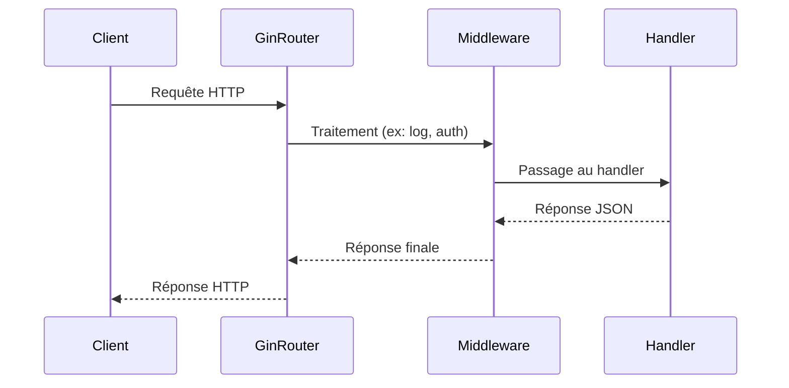

# Article 5-2-1 : Introduction au framework Gin pour simplifier le développement d’API en Go

## 5-Développement backend et exposition de services – Framework Gin

### Introduction

Gin est un framework web léger et performant pour Go, spécialement conçu pour faciliter et accélérer le développement d’API REST. Il fournit une API simple, un routage rapide, un middleware flexible et de nombreuses fonctionnalités utiles comme la gestion des requêtes JSON, la validation, et la gestion des erreurs, tout en conservant la simplicité du package standard `net/http`.

---

## 1. Pourquoi utiliser Gin ?

- **Performance élevée** : Gin est parmi les frameworks les plus rapides en Go grâce à sa conception efficace.
- **Routage expressif** : Supporte les routes avec paramètres, groupes, routes imbriquées.
- **Middleware efficace** : Possibilité d’intercaler des middlewares à tous les niveaux — global, groupe, route.
- **Support JSON natif** : Encodage/décodage facile des données.
- **Gestion intégrée des erreurs, validation, récupération des paniques**.
- **Documentation et communauté actives.**

---

## 2. Installation

```bash
go get -u github.com/gin-gonic/gin
```

---

## 3. Premier exemple avec Gin

```go
package main

import (
    "github.com/gin-gonic/gin"
    "net/http"
)

func main() {
    r := gin.Default() // crée un routeur avec middleware Logger et Recovery

    r.GET("/ping", func(c *gin.Context) {
        c.JSON(http.StatusOK, gin.H{"message": "pong"})
    })

    r.Run(":8080") // démarre le serveur sur le port 8080
}
```

---

## 4. Routage et handlers

Gin permet d'extraire facilement les paramètres d'URL et d'affecter des handlers à différentes méthodes HTTP :

```go
r.GET("/user/:id", func(c *gin.Context) {
    id := c.Param("id")
    c.JSON(http.StatusOK, gin.H{"user_id": id})
})
```

Pour les paramètres de requête (query strings) :

```go
r.GET("/search", func(c *gin.Context) {
    query := c.Query("q")
    page := c.DefaultQuery("page", "1")
    c.JSON(http.StatusOK, gin.H{"query": query, "page": page})
})
```

---

## 5. Middleware dans Gin

Gin utilise les middlewares basés sur le même principe de chaînage que `net/http`. Exemple de middleware simple :

```go
func MyMiddleware() gin.HandlerFunc {
    return func(c *gin.Context) {
        // Log avant la requête
        fmt.Println("Début de la requête")
        c.Next()  // passe au handler suivant
        // Log après la requête
        fmt.Println("Fin de la requête")
    }
}

func main() {
    r := gin.Default()

    r.Use(MyMiddleware())

    r.GET("/ping", func(c *gin.Context) {
        c.JSON(200, gin.H{"message": "pong"})
    })

    r.Run()
}
```

---

## 6. Exemple complet : API CRUD simple avec Gin

```go
package main

import (
    "github.com/gin-gonic/gin"
    "net/http"
    "strconv"
)

type User struct {
    ID int `json:"id"`
    Name string `json:"name"`
}

var users = []User{{ID: 1, Name: "Alice"}, {ID: 2, Name: "Bob"}}

func main() {
    r := gin.Default()

    r.GET("/users", func(c *gin.Context) {
        c.JSON(http.StatusOK, users)
    })

    r.GET("/users/:id", func(c *gin.Context) {
        id, _ := strconv.Atoi(c.Param("id"))
        for _, u := range users {
            if u.ID == id {
                c.JSON(http.StatusOK, u)
                return
            }
        }
        c.JSON(http.StatusNotFound, gin.H{"message": "Utilisateur non trouvé"})
    })

    r.POST("/users", func(c *gin.Context) {
        var newUser User
        if err := c.ShouldBindJSON(&newUser); err != nil {
            c.JSON(http.StatusBadRequest, gin.H{"error": err.Error()})
            return
        }
        newUser.ID = len(users) + 1
        users = append(users, newUser)
        c.JSON(http.StatusCreated, newUser)
    })

    r.Run(":8080")
}
```

---

## 7. Diagramme Mermaid – Flux simple d’une requête dans Gin



---

## 8. Sources

- [Gin Web Framework - Documentation officielle](https://github.com/gin-gonic/gin)
- [Gin by Example](https://ginbyexample.com/)
- [Go Web Examples - Gin](https://gowebexamples.com/gin/)
- [Awesome Go - Web Frameworks](https://awesome-go.com/#web-framework)

---

Le framework Gin simplifie grandement la création d’API REST en Go, offrant une syntaxe claire, des performances élevées, et une modularité poussée via les middlewares. Sa popularité repose sur sa facilité d’apprentissage et son intégration fluide avec les pratiques idiomatiques de Go.