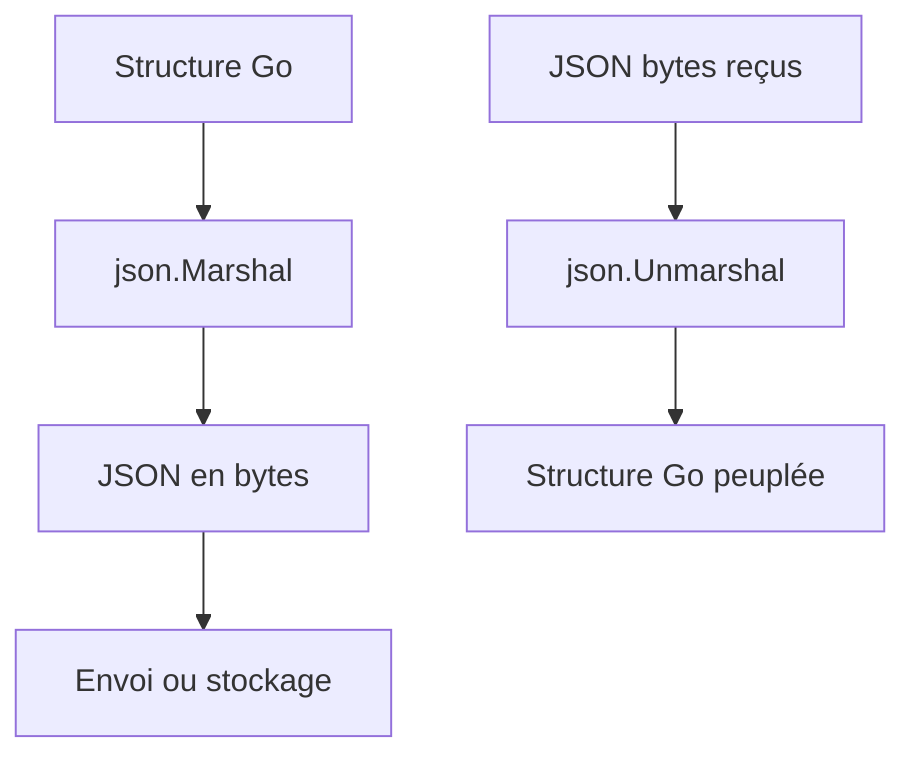

# Article 5-3-1 : Sérialisation JSON en Go – Package encoding/json et struct tags

## 5-Développement backend et exposition de services – Sérialisation JSON

### Introduction

Le format JSON est omniprésent pour l’échange de données dans les API web. Le package standard **encoding/json** en Go fournit des mécanismes puissants pour encoder et décoder les données JSON à partir et vers des structures Go. Les **struct tags** associés permettent de contrôler finement la sérialisation.

---

## 1. Sérialisation basique avec encoding/json

Pour transformer une structure Go en JSON, on utilise `json.Marshal` :

```go
package main

import (
    "encoding/json"
    "fmt"
)

type User struct {
    Name string
    Age  int
}

func main() {
    u := User{Name: "Alice", Age: 30}

    data, err := json.Marshal(u)
    if err != nil {
        panic(err)
    }
    fmt.Println(string(data)) // {"Name":"Alice","Age":30}
}
```

---

## 2. Contrôle de la sérialisation via struct tags

Les **tags JSON** permettent :

- **Renommer** les champs dans le JSON  
- Définir si le champ est optionnel (`omitempty`)  
- Contrôler la désérialisation

Exemple :

```go
type User struct {
    Name string `json:"full_name"`
    Age  int    `json:"age,omitempty"`
}
```

- `full_name` sera la clé dans le JSON au lieu de `Name`.  
- Si `Age` vaut 0 (valeur nulle), il ne sera pas inclus dans le JSON grâce à `omitempty`.

Exemple d’utilisation :

```go
u := User{Name: "Bob"}
data, _ := json.Marshal(u)
fmt.Println(string(data)) // {"full_name":"Bob"}
```

---

## 3. Champs non exportés et gestion des pointeurs

Le package `encoding/json` encode uniquement les champs exportés (première lettre majuscule).

Exemple :

```go
type User struct {
    name string // non exporté
    Age  int
}

u := User{name: "Alice", Age: 25}
data, _ := json.Marshal(u)
fmt.Println(string(data)) // {"Age":25}
```

Pour encoder un champ nullable ou optionnel, on peut utiliser un pointeur :

```go
type User struct {
    Name *string `json:"name,omitempty"`
}

name := "Charlie"
u := User{Name: &name}
```

---

## 4. Décodage JSON en struct

Inversement `json.Unmarshal` permet d’extraire les données JSON :

```go
var u User
jsonStr := `{"full_name":"Diana","age":22}`
err := json.Unmarshal([]byte(jsonStr), &u)
if err != nil {
    panic(err)
}
fmt.Println(u.Name, u.Age) // Diana 22
```

---

## 5. Exemple complet

```go
package main

import (
    "encoding/json"
    "fmt"
)

type Product struct {
    ID       int     `json:"id"`
    Name     string  `json:"name"`
    Price    float64 `json:"price,omitempty"`
    secret   string  // champ non exporté
}

func main() {
    p := Product{ID: 1, Name: "Ordinateur", Price: 999.99, secret: "cache"}
    data, _ := json.Marshal(p)
    fmt.Println(string(data)) // {"id":1,"name":"Ordinateur","price":999.99}

    jsonStr := `{"id":2,"name":"Clavier"}`
    var p2 Product
    json.Unmarshal([]byte(jsonStr), &p2)
    fmt.Printf("%+v\n", p2) // {ID:2 Name:Clavier Price:0 secret:}
}
```

---

## 6. Diagramme Mermaid – processus de sérialisation JSON



---

## 7. Sources

- [Package encoding/json - Documentation officielle](https://pkg.go.dev/encoding/json)
- [Go by Example - JSON](https://gobyexample.com/json)
- [Effective Go - Struct Tags](https://go.dev/doc/effective_go#json)
- [Blog - Go JSON Best Practices](https://blog.golang.org/json)

---

Maîtriser `encoding/json` et les struct tags est indispensable pour un développement backend fluide en Go, permettant un contrôle précis sur la forme et la nature des données échangées via vos API.