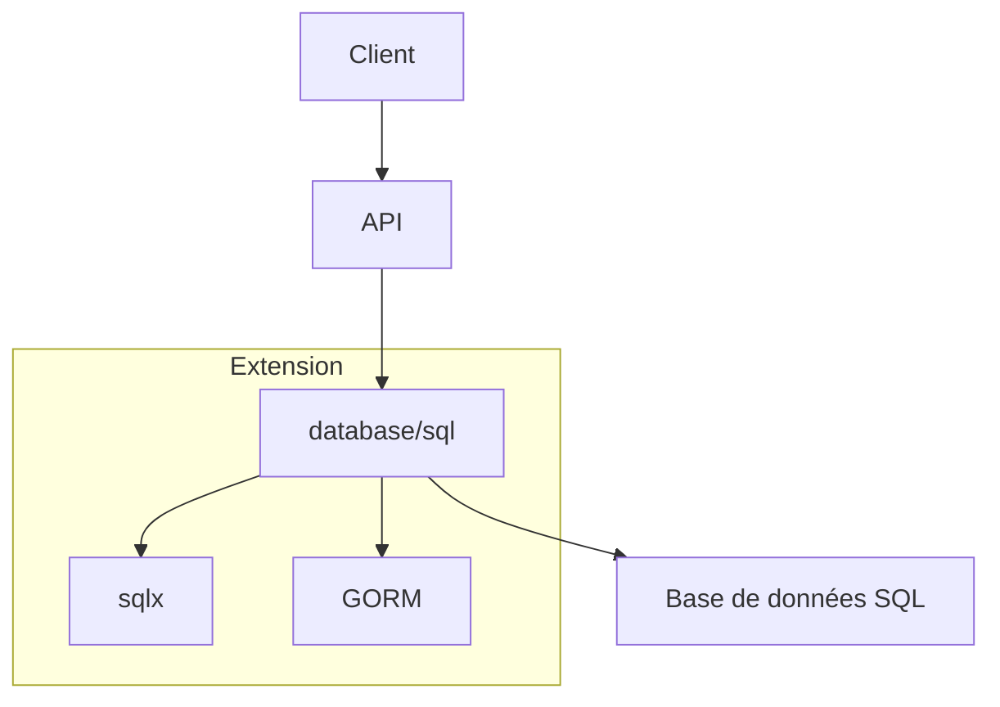

# Article 5-4-1 : Accès aux bases de données en Go – database/sql, introduction à sqlx et GORM

## 5-Développement backend et exposition de services – Accès aux bases de données

### Introduction

Pour interagir avec des bases de données relationnelles, Go fournit le package standard **database/sql**, qui définit une interface générique de communication avec différents systèmes SQL. Pour simplifier certaines opérations courantes et bénéficier de fonctionnalités avancées, des bibliothèques complémentaires comme **sqlx** et **GORM (Go Object Relational Mapper)** sont largement utilisées.

---

## 1. Package database/sql : interface standard

Le package `database/sql` permet de se connecter, exécuter des requêtes, et gérer des transactions de manière abstraite.

### Connexion et requête simple avec database/sql

```go
import (
    "database/sql"
    "fmt"
    _ "github.com/lib/pq" // pilote PostgreSQL
)

func main() {
    // Connexion à la base PostgreSQL
    db, err := sql.Open("postgres", "user=foo dbname=bar sslmode=disable")
    if err != nil {
        panic(err)
    }
    defer db.Close()

    // Requête simple
    var name string
    err = db.QueryRow("SELECT name FROM users WHERE id = $1", 1).Scan(&name)
    if err != nil {
        panic(err)
    }
    fmt.Println("Utilisateur:", name)
}
```

- `sql.Open` n’ouvre pas la connexion immédiatement mais prépare un pool.
- `QueryRow` récupère une ligne unique.
- Utilisation de placeholders pour éviter les injections SQL.

---

## 2. Limitations de database/sql

- Mapping manuel entre colonnes SQL et champs structs.
- Gestion manuelle des erreurs et du scan.
- Pas de support natif pour les struct tags.
- Peu d’aide pour les requêtes complexes.

---

## 3. sqlx : extension légère de database/sql

**sqlx** étend `database/sql` en ajoutant notamment :

- Mapping struct automatique grâce aux tags `db`.
- Méthodes pratiques (`Get`, `Select`) pour simplifier le scan des résultats.
- Support des transactions amélioré.
- Requêtes nommées plus lisibles.

### Exemple avec sqlx

```go
import (
    "fmt"
    "github.com/jmoiron/sqlx"
    _ "github.com/lib/pq"
)

type User struct {
    ID   int    `db:"id"`
    Name string `db:"name"`
}

func main() {
    db, err := sqlx.Connect("postgres", "user=foo dbname=bar sslmode=disable")
    if err != nil {
        panic(err)
    }
    defer db.Close()

    var user User
    err = db.Get(&user, "SELECT id, name FROM users WHERE id=$1", 1)
    if err != nil {
        panic(err)
    }
    fmt.Println(user)
}
```

---

## 4. GORM : ORM complet avec abstraction avancée

**GORM** est un Object-Relational Mapper (ORM) complet qui permet :

- Définir des modèles struct, avec relations entre entités.
- Opérations CRUD simples via méthodes dédiées.
- Migrations de schéma intégrées.
- Support des hooks et scopes.
- Gestion des transactions, preload, pagination.

### Exemple simple avec GORM

```go
import (
    "fmt"
    "gorm.io/driver/postgres"
    "gorm.io/gorm"
)

type User struct {
    ID   uint
    Name string
}

func main() {
    dsn := "user=foo password=bar dbname=baz sslmode=disable"
    db, err := gorm.Open(postgres.Open(dsn), &gorm.Config{})
    if err != nil {
        panic(err)
    }

    // Migration automatique
    db.AutoMigrate(&User{})

    user := User{Name: "Alice"}
    db.Create(&user)

    var u User
    db.First(&u, 1)
    fmt.Println(u.Name)
}
```

---

## 5. Comparaison rapide

| Aspect                  | database/sql            | sqlx                         | GORM                         |
|-------------------------|------------------------|-----------------------------|------------------------------|
| Abstraction             | Faible (bas-niveau)    | Moyenne (extensions)         | Élevée (ORM complet)          |
| Mapping struct          | Manuel                 | Automatique via tags          | Automatique                   |
| Support relations       | Non                    | Non                         | Oui                          |
| Migrations intégrées    | Non                    | Non                         | Oui                          |
| Courbe d’apprentissage  | Faible (simple)        | Modérée                     | Plus élevée                  |

---

## 6. Diagramme Mermaid – workflow accès base de données



---

## 7. Sources

- [Package database/sql - documentation officielle](https://pkg.go.dev/database/sql)
- [sqlx GitHub](https://github.com/jmoiron/sqlx)
- [GORM Official Site](https://gorm.io/)
- [Go Database/SQL Best Practices](https://blog.golang.org/database-sql)
- [Comparison of Go ORMs](https://medium.com/@shijuvar/go-orm-comparison-2020-7dc891b3df5e)

---

L'accès aux bases de données SQL en Go évolue du contrôle précis et manuel de `database/sql` vers des solutions plus expressives et productives comme **sqlx** ou **GORM**. Le choix dépend des besoins du projet en termes de complexité, performances et automatisations.